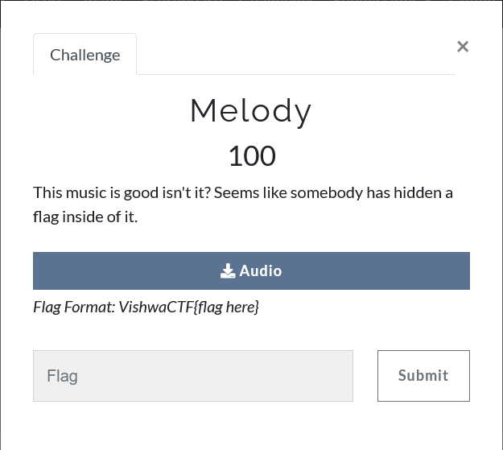

## Melody

Title : Melody

Category : Steganography

Description : This music is good isn't it? Seems like somebody has hidden a flag inside of it.
 
 
<a class="btn btn-info btn-file mb-1 d-inline-block px-2 w-100 text-truncate" href="/files/0684f43881f5b72cf6b6d61647a2e4db/Bad_Snacks_-_Oh_Shoot_HD.wav">	<i class="fas fa-download"></i>	Audio	</a>
*Flag Format: VishwaCTF{flag here}*

Hints : None

Files : Bad_Snacks_-_Oh_Shoot_HD.wav

Points : 100

Solves : 5

Flags : vishwaCTF{CONGRATULATIONS CODE BREAKER}

## Solution

So we are given a wav file, which obviously has some data inside of it

Run the file through Deepsound, and you get flag.rar

Inside this rar file is a txt file

It contains the following text in it:

Decode The Message

carrot fiasco nephew spring rabbit
sonata tailor bureau legacy corona
travel bikini object happen soften
picnic option waited effigy adverb
report accuse animal shriek esteem
oyster

Now, the key to decode this message is to take firt letter off the odd words and last letter of the even words, and voila you get the flag!!

flag: vishwaCTF{CONGRATULATIONS CODE BREAKER}
